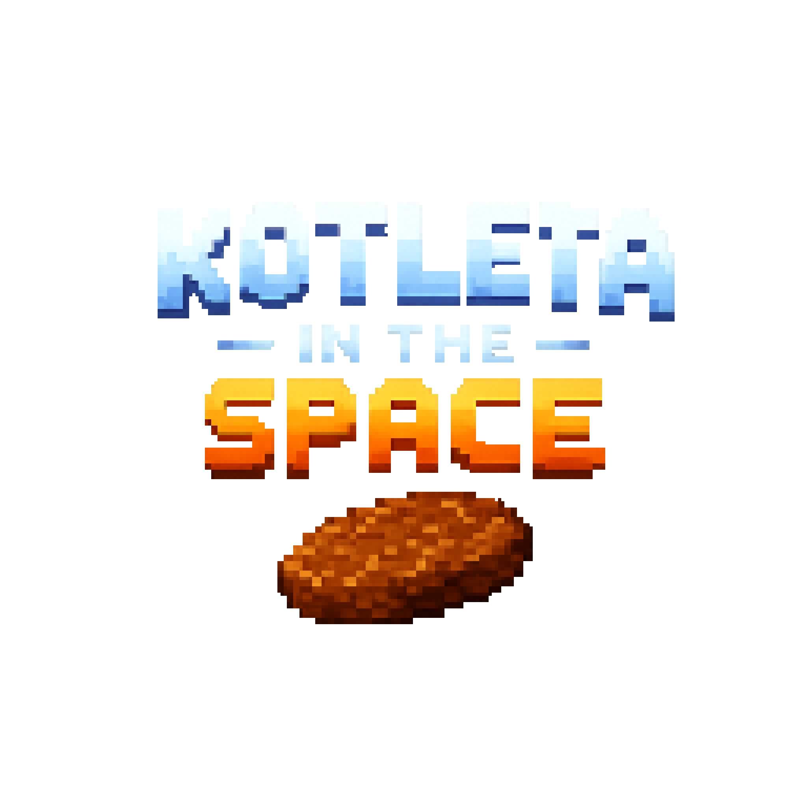

# KOTLETA IN THE SPACE
**Проста піксельна гра, створена на Python за допомогою Kivy та KivyMD.**

# Логотип

  

# Суть гри
У далекому куточку галактики існувала мирна планета Котлетонія, де жили розумні космічні котлети. Вони спокійно подорожували між зорями та насолоджувалися своїм безтурботним і соковитим життям.
Але одного дня з темних глибин космосу з'явилася армія Фаршу під командуванням безжального генерала М'яса. Їхня мета — перетворити весь Всесвіт на одну величезну м'ясорубку.

Ти — остання бойова Котлета Космічного Флоту. Твій генерал — легендарна Відбивна, яка доручила тобі найважливішу місію в історії Котлетонії.

Твоя мета — знищити якомога більше бойових одиниць Фаршу та зібрати достатньо коштів для того, щоб забезпечити спокійне майбутнє Котлетонії.

Але пам'ятай: провал місії означатиме загибель усієї цивілізації Котлеток.

Ти — остання надія Котлетонії.

# Особливості гри
* Піксельна графіка
* Космічні битви
* Ворожі кораблі
* Астероїди
* Система здоров'я
* Збереження та завантаження гри
* Звукові ефекти та музика

# Подяка
Дякуємо, що граєте в **KOTLETA IN THE SPACE**!
Сподіваємося, що подорож космосом у ролі бойової котлети подарує вам гарний настрій.
Бажаємо вдалого польоту та перемоги над Фаршем!)
